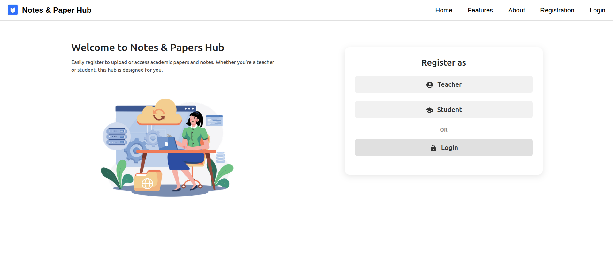
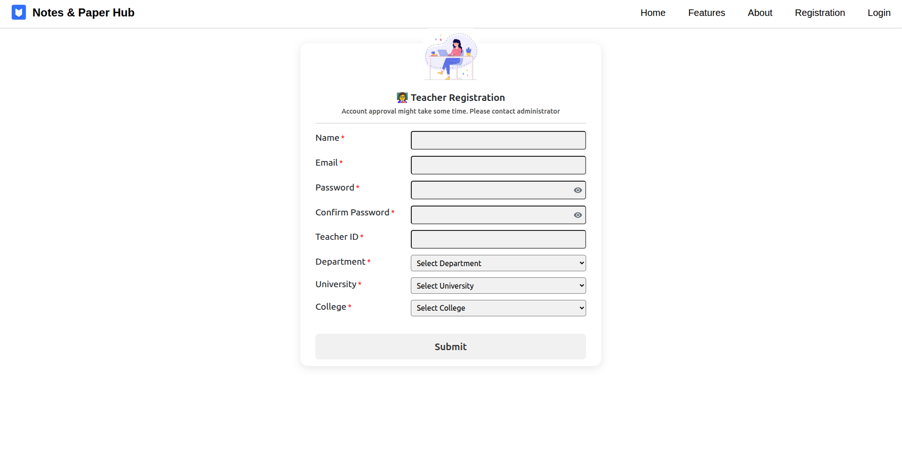
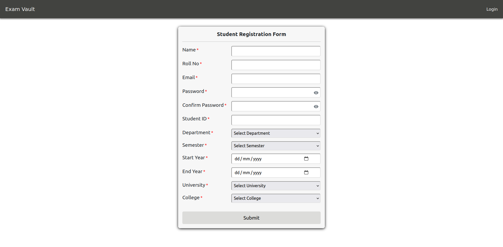
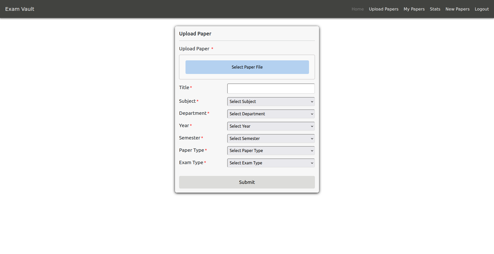
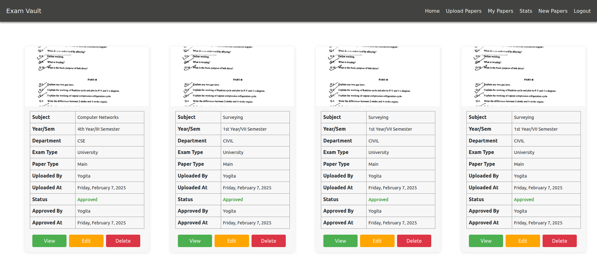

# 📚 Notes & Paper Hub

**Notes & Paper Hub** is a role-based web application designed to streamline the **management and distribution of academic exam papers and study notes**. It empowers **teachers** to upload, review, and approve student-submitted resources, and allows **students** to easily access approved **papers and notes**. The platform includes powerful features like real-time statistics, dynamic filters, secure file uploads, and role-based access control—making it a comprehensive academic repository system for educational institutions.

---

## 🚀 Table of Contents

- [🧠 Introduction](#-introduction)
- [⚙️ Tech Stack](#-tech-stack)
- [📑 Functionalities](#-functionalities)
- [💡 Component-wise Explanation](#-component-wise-explanation)
  - [1. Authentication & Authorization](#1-authentication--authorization)
  - [2. Registration & Login](#2-registration--login)
  - [3. All Papers Page](#3-all-papers-page)
  - [4. Upload Paper](#4-upload-paper)
  - [5. Upload Notes](#5-upload-notes)
  - [6. My Papers](#6-my-papers-page)
  - [7. New Papers (Teacher Review)](#7-new-papers-teacher-review)
  - [8. Statistics Dashboard](#8-statistics-dashboard)
  - [9. Logout](#9-logout)
- [Edge Case Handling](#-middleware--edge-case-handling)

---

## Introduction

Notes & Paper Hub serves as a **centralized repository** for academic exam papers and study notes. It provides:

- Role-based authentication (Teacher/Student)
- Resource submission and review workflows
- Filtering and search capabilities
- Approval system with dynamic content rendering
- Teachers can directly upload notes and manage student submissions
- Students can download approved notes and papers
- Secure, intuitive user experience
---

## ⚙️ Tech Stack 

### 🔧 Frontend
- **React.js** 
- **Bootstrap** 
- **React Router** 
- **CSS** 
- **Axios** 
- **Chart.js(for stats)**

### 🛠 Backend
- **Node.js** 
- **Express.js** 
- **MongoDB +Mongoose** 
- **JWT(JSON Web Token)**

---
## 📑 Functionalities

- 👤 Register as a **Teacher** or **Student**
- 🔐 Login with secure JWT-based authentication
- 📄 Students can upload exam papers (pending teacher review)
- 📄 Teachers can upload exam papers (auto-approved)
- 📝 Teachers can upload subject-wise notes directly
- 📥 Students can download teacher-uploaded notes
- 📊 View & filter approved exam papers and notes
- 📁 "My Papers" section for users to track their own uploads
- 📂 "My Notes" section for teachers to view their uploaded notes
- ✅ Teachers can approve/reject/edit student-submitted exam papers
- 📈 Stats Dashboard with dynamic charts and insights
- 🔍 Pagination, filtering, and search functionality
- 🚪 Logout and session clearing

---
## 💡 Component-wise Explanation

### 1. Authentication & Authorization 

- ✅ JWT Token for secure login
- 🧾 Middleware verifies token for all protected routes 
- 🔐 Role-based access: 
  - Students can only view approved papers & upload the papers
  - Teachers can access new papers review, approval, and edit functionalities
---
### 2. Registration & Login
- Authentication is done via **Firebase Authentication**
- User Approval Status: 
 - For Students: Auto-approved 
 - For teachers: Pending(Manual approval by admin)



#### 👨‍🏫 Teacher Registration:


#### 🧑 Student Registration:



#### 🔐 Login: 

- Email + Password verified
- JWT Token generated 
- Role and approval status checked 
- Redirect: 
 - Student ➝ /all-paper
 - Teacher ➝ If approved ➝ /all-paper, else ➝ /register

---
### 3. 🗂️ All Papers Page

- 📜 Displays only papers with status: `approved`
- 📄 Information shown:
  - Title
  - Subject
  - Semester
  - Department
  - Paper Type
  - Exam Type


- 🔍 Search:
  - Search papers by **title**

- 🎛️ Filters:
  - Department
  - Semester
  - Year
  - Subject
  - Paper Type (Main / Back / Other)
  - Exam Type (University / Mid-Term / Important)

- 📊 Pagination:
  - Displays 12 papers per page
  - Maintains page state during search and filtering

- ✏️ Edit Button:
  - Visible only to users with role `teacher`
  - Allows editing of approved papers

---
### 4. 📤 Upload Paper

- 📎 Supported File Types:
  - `.pdf`, `.png`, `.jpeg`

- 📝 Required Fields:
  - Department
  - Title
  - Subject
  - Semester
  - Exam Type
  - Paper Type

- 🧠 Logic:
  - If **student** uploads a paper → `status: pending`
    - Routed to "New Papers" for teacher review
  - If **teacher** uploads a paper → `status: approved`
    - Immediately visible on All Papers page




---
### My Papers (Upload History)
- Users can view all papers they have uploaded.
- Displays paper status: **Pending, Approved, Rejected**.

 


---

### 5. 📝 New Papers (Teacher Review)

- 🔐 Only accessible to **teachers**
- 📄 Lists all papers uploaded by **students** with `status: pending`

- 👨‍🏫 Teacher Actions:
  - ✅ **Approve**:
    - Changes status to `approved`
    - Paper appears in All Papers
  - ❌ **Reject**:
    - Opens a modal where the teacher writes a comment explaining rejection
    - Paper status changes to `rejected`
  - ✏️ **Edit**:
    - Opens a pre-filled form allowing the teacher to update paper metadata or upload a new file

---

### 6. 📊 Statistics Dashboard

> Built using **Chart.js** with dynamic data fetched via MongoDB aggregation

- 🟢 **Pie Chart 1**: Paper Review Status
  - Shows count of Approved, Pending, and Rejected papers

- 🟡 **Pie Chart 2**: Department-wise Paper Count
  - Displays how many papers are approved under each department

- 🔵 **Pie Chart 3**: Paper Type Breakdown
  - Main / Back / Other

- 🔴 **Pie Chart 4**: Exam Type Distribution
  - University / Mid-Term / Important

- 👥 **Access**:
  - Both students and teachers can view this page


---

### 7. 🚪 Logout

- Clears the JWT token from `sessionStorage`
- Redirects user to the **Login** page
- Secure logout using React navigation

---

### ⚠️ Edge Cases Handled

- ❌ Duplicate registration is prevented using unique email/ID checks
- 🔐 Invalid login credentials return proper error messages
- 🚫 Unauthorized users are blocked from accessing protected routes
- 🧾 Teachers with status `not_approved` are restricted from entering the app
- 📎 Invalid file types or large files are rejected with clean error messages
- 🔍 Filters and search gracefully handle no results (e.g., “No papers found”)
- 🌐 API/network errors are caught and displayed to the user

---


#### Starting the Client
```sh 
#Navigate to client folder
cd exam_vault/client/exam-vault
# Install Dependencies 
yarn add 
# Start the client
yarn start
```

#### Starting the Server 
```
# Navigate to the server folder
cd exam_vault/backend

# Start the server
node server.js
```


