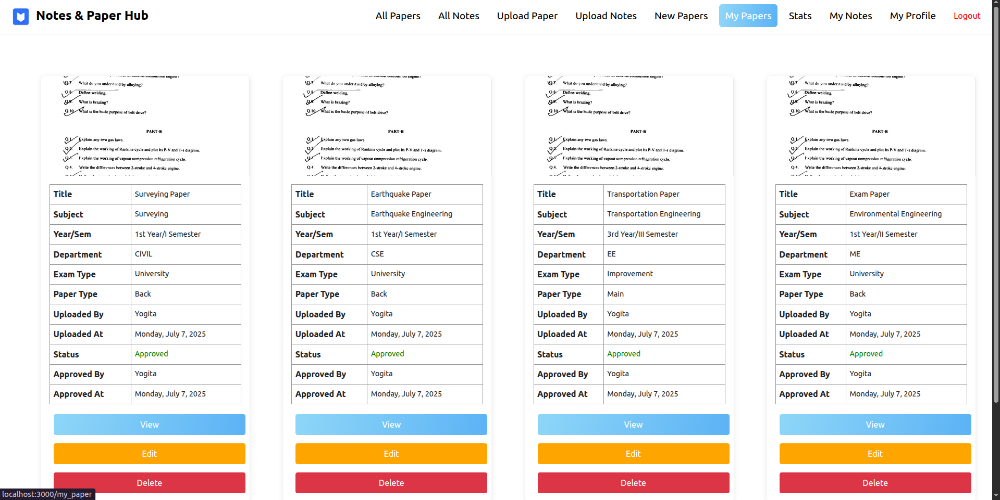

# ExamVault

## Introduction
**ExamVault** is a web-based application that allows teachers and students to upload, manage, and review academic papers. 

---

##  Features

### Authentication
- **Registration & Login** for teachers and students.


- Authentication is done via **Firebase Authentication**.

### Dashboard (After Login)
- **Teachers and Students** can see all **approved papers**.


### Upload Papers
- Teachers and students can upload:
  - **University Exam Papers**
  - **Midterm Exam Papers**
  - **Improvement Exam Papers**

  


### My Papers (Upload History)
- Users can view all papers they have uploaded.
- Displays paper status: **Pending, Approved, Rejected**.

 

### Paper Statistics
- View insights such as:
  - Number of **Approved, Pending, and Rejected** papers.
  - Paper count based on **exam type** (University, Midterm, Improvement).
  - Paper count based on **paper type**.
  Paper count based on **department wise**.


### Teacher-Specific Actions
- **Approve or Reject** student-uploaded papers.
- Student papers are **Pending** by default until reviewed.

### Logout
- Secure **Logout** functionality, Clear cache, remove token.


---

## Tech Stack
- **Frontend:** React.js (Create React App)
- **Authentication:** Firebase Authentication
- **Backend:** Node.js & Express.js
- **Database:** MongoDB


---


#### Starting the Client
```sh 
#Navigate to client folder
cd exam_vault/client/exam-vault
# Install Dependencies 
yarn add 
# Start the client
yarn start
```

#### Starting the Server 
```
# Navigate to the server folder
cd exam_vault/backend

# Start the server
node server.js
```


