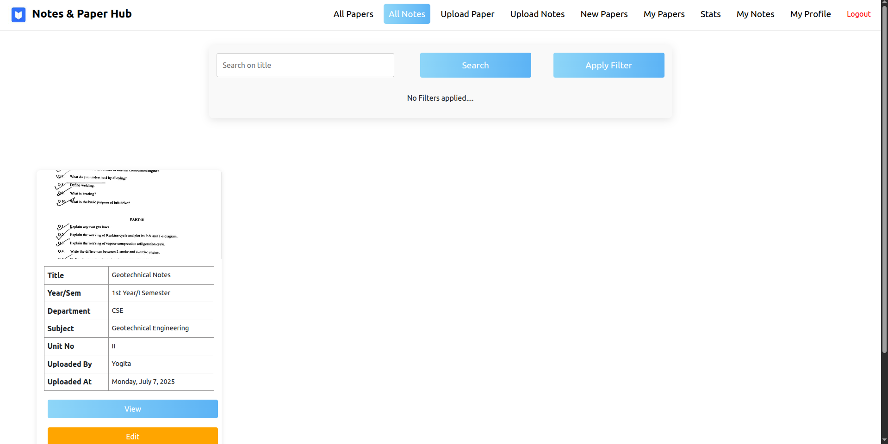

# 📚 Notes & Paper Hub

**Notes & Paper Hub** is a role-based web application designed to streamline the **management and distribution of academic exam papers and study notes**. It empowers **teachers** to upload, review, and approve student-submitted resources, and allows **students** to easily access approved **papers and notes**. The platform includes powerful features like real-time statistics, dynamic filters, secure file uploads, and role-based access control—making it a comprehensive academic repository system for educational institutions.

---

## 🚀 Table of Contents

- [Introduction](#introduction)
- [Tech Stack](#tech-stack)
- [Functionalities](#functionalities)
- [Component-wise Explanation](#component-wise-explanation)
  - [1. Authentication & Authorization](#1-authentication--authorization)
  - [2. Registration & Login](#2-registration--login)
  - [3. All Papers Page](#3-all-papers-page)
  - [4. All Notes Page](#4-all-notes-page)
  - [5. Upload Paper](#5-upload-paper)
  - [6. Upload Notes](#6-upload-notes)
  - [7. My Papers](#7-my-papers)
  - [8. My Notes](#8-my-notes)
  - [9. New Papers (Teacher Review)](#9-new-papers-teacher-review)
  - [10. Statistics Dashboard](#10-statistics-dashboard)
  - [11. Logout](#11-logout)
- [Edge Case Handling](#edge-case-handling)
- [Start the Project](#start-the-project)

---

## Introduction

Notes & Paper Hub serves as a **centralized repository** for academic exam papers and study notes. It provides:

- Role-based authentication (Teacher/Student)
- Resource submission and review workflows
- Filtering and search capabilities
- Approval system with dynamic content rendering
- Teachers can directly upload notes and manage student submissions
- Students can download approved notes and papers
- Secure, intuitive user experience

---

## ⚙️ Tech Stack 

### Frontend
- **React.js** 
- **Bootstrap** 
- **React Router** 
- **CSS** 
- **Axios** 
- **Chart.js (for stats)**

### Backend
- **Node.js** 
- **Express.js** 
- **MongoDB + Mongoose** 
- **JWT (JSON Web Token)**

---

## 📑 Functionalities

- 👤 Register as a **Teacher** or **Student**
- 🔐 Login with secure JWT-based authentication
- 📄 Students can upload exam papers (pending teacher review)
- 📄 Teachers can upload exam papers (auto-approved)
- 📝 Teachers can upload subject-wise notes directly
- 📥 Students can download teacher-uploaded notes
- 📊 View & filter approved exam papers and notes
- 📁 "My Papers" section for users to track their own uploads
- 📂 "My Notes" section for teachers to view their uploaded notes
- ✅ Teachers can approve/reject/edit student-submitted exam papers
- 📈 Stats Dashboard with dynamic charts and insights
- 🔍 Pagination, filtering, and search functionality
- 🚪 Logout and session clearing

---

## 💡 Component-wise Explanation

### 1. Authentication & Authorization 

- ✅ JWT Token for secure login
- 🧾 Middleware verifies token for all protected routes 
- 🔐 Role-based access: 
  - Students can only view approved papers & upload the papers
  - Teachers can access new papers review, approval, and edit functionalities

---

### 2. Registration & Login

- Authentication is done via **Firebase Authentication**
- User Approval Status: 
  - For Students: Auto-approved 
  - For Teachers: Pending (Manual approval by admin)

**Screenshots**  
  
  
  


---

### 3. All Papers Page

- Displays only papers with status: `approved`
- Information shown:
  - Title, Subject, Semester, Department, Paper Type, Exam Type
- 🔍 Search by title  
- 🎛️ Filters:
  - Department, Semester, Year, Subject, Paper Type, Exam Type  
- 📊 Pagination (12 papers per page)
- ✏️ Edit Button for teachers only

**Screenshot**  


---

### 4. All Notes Page

- Displays all approved notes uploaded by teachers
- Students can download these notes
- Filters by department, subject, and semester
- Search by note title
- Paginated view

**Screenshot**  


---

### 5. Upload Paper

- Supported File Types: `.pdf`, `.png`, `.jpeg`
- Required Fields:
  - Department, Title, Subject, Semester, Exam Type, Paper Type

**Logic:**
- Student Upload ➝ `status: pending`
- Teacher Upload ➝ `status: approved`

**Screenshot**  


---

### 6. Upload Notes

- Only available to teachers
- Teachers can upload notes directly (no review required)
- Required:
  - Title, Department, Subject, Semester, and file

**Screenshot**  


---

### 7. My Papers

- View all papers uploaded by the logged-in user
- Status: Pending, Approved, Rejected

**Screenshot**  


---

### 8. My Notes

- Visible only to teachers
- Shows all notes uploaded by the teacher
- Option to edit details or update the file

**Screenshot**  


---

### 9. New Papers (Teacher Review)

- For teachers only
- Shows papers uploaded by students (status: pending)
- Actions:
  - ✅ Approve
  - ❌ Reject (with reason)
  - ✏️ Edit metadata or file

**Screenshot**  


---

### 10. Statistics Dashboard

Built using **Chart.js** + MongoDB aggregation

- 📊 Pie Chart 1: Paper Review Status
- 📘 Pie Chart 2: Department-wise Paper Count
- 📂 Pie Chart 3: Paper Type Breakdown
- 🧪 Pie Chart 4: Exam Type Distribution

**Screenshot**  


---

### 11. Logout

- Clears JWT token from `sessionStorage`
- Redirects to Login page
- Secures logout process

---

## ⚠️ Edge Case Handling

- ❌ Duplicate registration prevented
- 🔐 Invalid login credentials show proper error messages
- 🚫 Unauthorized access blocked
- 📎 Invalid/large files rejected cleanly
- 🧾 Teachers with `not_approved` status restricted
- 🔍 Empty filter/search states handled gracefully
- 🌐 API/network errors caught and displayed

---

## 🏁 Start the Project
#### Starting the Client
```sh 
#Navigate to client folder
cd exam_vault/client/exam-vault
# Install Dependencies 
yarn add 
# Start the client
yarn start
```

#### Starting the Server 
```
# Navigate to the server folder
cd exam_vault/backend

# Start the server
node server.js
```


